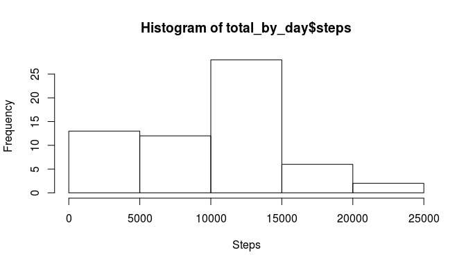
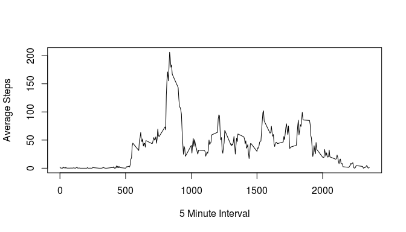
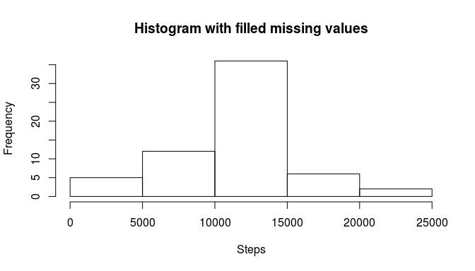
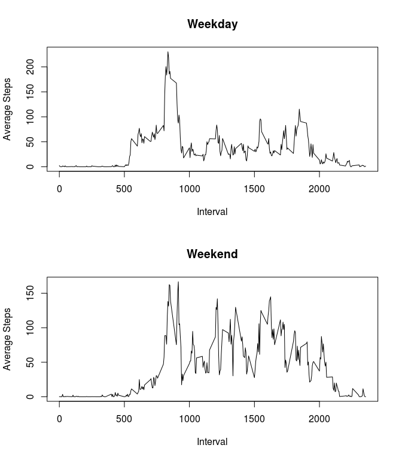

# Reproducible Research: Peer Assessment 1


## Loading and preprocessing the data
###Load libraries

```r
library(dplyr)  
```

```
## 
## Attaching package: 'dplyr'
## 
## The following object is masked from 'package:stats':
## 
##     filter
## 
## The following objects are masked from 'package:base':
## 
##     intersect, setdiff, setequal, union
```

```r
library(ggplot2)  
```

###Save the URL  

```r
zipurl<-"https://d396qusza40orc.cloudfront.net/repdata%2Fdata%2Factivity.zip"
##Download the zipfile  
fzip<-download.file(zipurl,destfile="./dfile.zip",method="curl")
##Unzipped the file into the current drive  
unzip("./dfile.zip", list = FALSE, overwrite = TRUE,
      junkpaths = FALSE, exdir = ".", unzip = "internal",
      setTimes = FALSE)

dfile<-read.csv("activity.csv",header = T,na.strings = "NA")
```

## What is mean total number of steps taken per day?
###Calculate the total number of steps taken per day  

```r
group_by_day_data<-group_by(dfile,date)
total_by_day<-summarize(group_by_day_data,steps=sum(steps,na.rm = T))
total_steps_by_day <-sum(total_by_day$steps)
```
####**The total number of steps taken per day is 570608**  
  
###Make a histogram of the total number of steps taken each day  

```r
hist(total_by_day$steps,xlab="Steps",ylab = "Frequency")
```

 

###Calculate and report the mean and median of the total number of steps taken per day  

```r
mean_by_day<-mean(total_by_day$steps)
median_by_day<-median(total_by_day$steps)
```

####**The Mean number of steps is 9354.2295082 and the median is 10395.**


## What is the average daily activity pattern?  
###Make a time series plot (i.e. type = "l") of the 5-minute interval (x-axis) and the average number of steps taken, averaged across all days (y-axis)   


```r
k<-group_by(dfile,interval)
mean_interval<-summarize(k,steps=mean(steps,na.rm = T))
plot(mean_interval$steps~mean_interval$interval,type="l",xlab="5 Minute Interval",ylab = "Average Steps")
```

 

##Which 5-minute interval, on average across all the days in the dataset, contains the maximum number of steps?  

```r
max_interval<-mean_interval$interval[which.max(mean_interval$steps)]
```

####**The 5-minute interval with the maximum number of steps is 835**  


## Inputing missing values

###Calculate and report the total number of missing values in the dataset (i.e. the total number of rows with NAs)  

```r
naset<-is.na(dfile$steps)
num_missing<-sum(naset)
```

####**The number of missing values is 2304**  

###Devise a strategy for filling in all of the missing values in the dataset. The strategy does not need to be sophisticated. For example, you could use the mean/median for that day, or the mean for that 5-minute interval, etc.  
  
####***To fill in the missing values, I'll use the mean values for that five minute interval***

##Create a new dataset but with the missing data filled in

```r
na_repset<-dfile[naset,]
na_freeset<-dfile[!naset,]
na_repset2<-merge(x=na_repset,y=mean_interval,by = "interval",all.x = T)
na_repset2$steps<-na_repset2$steps.y
na_repset2<-na_repset2[,c(5,3,1)]

filled_set<-rbind(na_freeset,na_repset2)
```

###Make a histogram of the total number of steps taken each day and Calculate and report the mean and median total number of steps taken per day. 

```r
filledgroupbyday<-group_by(filled_set,date)
filled_total_by_day<-summarize(filledgroupbyday,steps=sum(steps,na.rm = T))
hist(filled_total_by_day$steps,xlab="Steps",ylab = "Frequency",main = "Histogram with filled missing values")
```

 

###Calculating and reporting the mean and median total number of steps taken per day

```r
total_steps_by_day <-sum(total_by_day$steps)
filled_tot_steps_by_day <-sum(filled_set$steps)

total_steps_by_day
```

```
## [1] 570608
```

```r
filled_tot_steps_by_day
```

```
## [1] 656737.5
```

```r
filled_mean<-mean(filled_total_by_day$steps)
filled_median<-median(filled_total_by_day$steps)
```


###Do these values differ from the estimates from the first part of the assignment? 
####**Yes, they differ significantly, the original total was 570608 and the new total is 6.5673751\times 10^{5} while the original mean was 9354.2295082 and the new one is 1.0766189\times 10^{4}. The original median was 10395 and the new one is 1.0766189\times 10^{4}**

###What is the impact of inputing missing data on the estimates of the total daily number of steps?
  
####**It seems that using the average to fill in the missing values has created a more bell-shaped distribution to the frequency of steps by day, reducing the skew of the data when looked at on a daily basis (opposed to the aggregate data).**

### Are there differences in activity patterns between weekdays and weekends?  
  
###Create a new factor variable in the dataset with two levels – “weekday” and “weekend” indicating whether a given date is a weekday or weekend day.


```r
filled_set$weekday<-lapply(as.Date(filled_set$date),weekdays)
filled_set$weekday[(weekdays(as.Date(filled_set$date)) %in% c('Saturday','Sunday'))]<- 'Weekend'
filled_set$weekday[!(weekdays(as.Date(filled_set$date)) %in% c('Saturday','Sunday'))]<-'Weekday'
filled_set$weekday<-as.factor(unlist(filled_set$weekday))
```


###Make a panel plot containing a time series plot (i.e. type = "l") of the 5-minute interval (x-axis) and the average number of steps taken, averaged across
###all weekday days or weekend days (y-axis).   


```r
fset2<-with(filled_set, tapply(steps, list(interval, weekday), mean))
fset2<-as.data.frame(fset2)
fset2$interval<-rownames(fset2)

par(mfrow=c(2,1))

plot(fset2$Weekday~fset2$interval,type="l",xlab="Interval",ylab="Average Steps",main ="Weekday")
plot(fset2$Weekend~fset2$interval,type="l",xlab="Interval",ylab="Average Steps",main="Weekend")
```

 

####**Yes weekends, seems to have higher average steps per interval**
